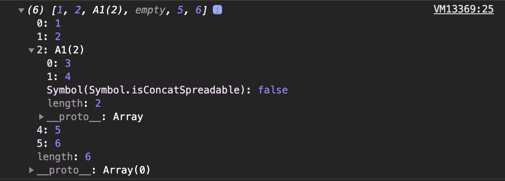

# 原生H5、CSS、JavaScript面试题

### 0x0001

Q：JavaScript 与 ECMAScript 是什么关系？

A：1996年8月，微软模仿 JavaScript 开发了一种相近的语言，取名为JScript（JavaScript 是 Netscape 的注册商标，微软不能用），首先内置于IE 3.0。Netscape公司面临丧失浏览器脚本语言的主导权的局面。

1996年11月，Netscape 公司决定将 JavaScript 提交给国际标准化组织 ECMA（European Computer Manufacturers Association），希望 JavaScript能够成为国际标准，以此抵抗微软。ECMA 的39号技术委员会（Technical Committee 39）负责制定和审核这个标准，成员由业内的大公司派出的工程师组成，目前共25个人。该委员会定期开会，所有的邮件讨论和会议记录，都是公开的。

1997年7月，ECMA 组织发布262号标准文件（ECMA-262）的第一版，规定了浏览器脚本语言的标准，并将这种语言称为 ECMAScript。这个版本就是 ECMAScript 1.0 版。之所以不叫JavaScript，一方面是由于商标的关系，Java 是 Sun 公司的商标，根据一份授权协议，只有 Netscape 公司可以合法地使用 JavaScript 这个名字，且 JavaScript 已经被 Netscape公司注册为商标，另一方面也是想体现这门语言的制定者是 ECMA，不是 Netscape，这样有利于保证这门语言的开放性和中立性。因此，ECMAScript 和 JavaScript的关系是，前者是后者的规格，后者是前者的一种实现。在日常场合，这两个词是可以互换的。

ECMAScript 只用来标准化 JavaScript 这种语言的基本语法结构，与部署环境相关的标准都由其他标准规定，比如 DOM 的标准就是由 W3C组织（World Wide Web Consortium）制定的。

我们经常说的ES5、ES6就是ECMAScript 5.x、ECMAScript 6.x这种脚本语言的标准的简称。

2015年6月，ECMAScript 6 正式发布，并且更名为“ECMAScript 2015”。这是因为 TC39 委员会计划，以后每年发布一个 ECMAScript 的版本，下一个版本在2016年发布，称为“ECMAScript
2016”，2017年发布“ECMAScript 2017”，以此类推。

### 0x0002

Q：这段代码最后会输出什么值？

```javascript
var a = 1;
var a;
console.log(a);
```

A：通常，使用`var`关键字声明一个变量但是没有赋值，那么这个变量内容是`undefined`。但是如果使用`var`重新声明一个已经存在的变量（但是没有新赋值），解析器会判定这行代码是无效的。 所以输出结果：

```javascript
1
```

Q：那么这段代码最后会又输出什么值？

```javascript
var a = 1;
var a = 2;
console.log(a);
```

A：使用`var`重新声明一个已经存在的变量且赋了新值，解析器则会覆盖原有的值。 所以输出结果：

```javascript
2
```

### 0x0003

Q：分别执行这两段代码，他们都分别会报错吗？

代码1

```javascript
console.log(a);
```

代码2

```javascript
console.log(a);
var a = 1;
```

A：代码1会报错，代码2不会报错。代码1会报出错误：

```shell
Uncaught ReferenceError: a is not defined
```

因为JavaScript 引擎的工作方式是，先解析代码，获取所有被声明的变量，然后再一行一行地运行。 这造成的结果，就是所有的变量的声明语句，都会被提升到代码的头部，这叫做变量提升（hoisting）。
上面代码2首先使用console.log方法，在控制台显示变量a的值。 这时变量a还没有声明和赋值，所以这是一种错误的做法， 但是实际上不会报错。因为存在变量提升，真正运行的是下面的代码，所以代码2才不会报错。

```javascript
var a;
console.log(a);
a = 1;
```

代码2最后控制台输出的是：

```javascript
undefined
```

### 0x0004

Q：以下 哪些变量命名是不合法的？

```html
arg0
π
1a
_tmp
23
$elem
***
变量名称
a+b
-d
```

A：简单的说，标识符命名规则如下：

1. 第一个字符，可以是任意 Unicode 字母（包括英文字母和其他语言的字母），以及美元符号（$）和下划线（_）。

2. 第二个字符及后面的字符，除了 Unicode 字母、美元符号和下划线，还可以用数字0-9。

3. JavaScript 有一些保留字，不能用作标识符：

```html
arguments、break、case、catch、class、const、
continue、debugger、default、delete、do、else、
enum、eval、export、extends、false、finally、for、
function、if、implements、import、in、instanceof、
interface、let、new、null、package、private、
protected、public、return、static、super、switch、
this、throw、true、try、typeof、var、void、while、
with、yield。
```

注意：因为支持Unicode，所以变量名是可以使用中文的。

```html
arg0
π
1a // 不合法，第一个字符不能是数字
_tmp
23 // 不合法，第一个字符不能是数字
$elem
*** // 不合法，标识符不能包含星号
变量名称
a+b // 不合法，标识符不能包含加号
-d // 不合法，标识符不能包含减号或连词线
```

### 0x0005

Q：下面代码最终会输出什么结果：

```javascript
var x = 1;
x = 2; <!-- x = 3;
-->
x = 4;
console.log(x);
```

A：由于 JavaScript 可以兼容 HTML 代码的注释，所以<!--和-->也被视为合法的单行注释。

即上面代码中`<!-- x = 3;`和`--> x = 4;`都不会背执行。所以，最后输出结果是：

```javascript
2
```

需要注意的是 -->只有在行首，才会被当成单行注释，否则会当作正常的运算

```javascript
var x = 2;
if (x-- > 0) {
  console.log(x)
}
```

比如说上面的代码，x --> 0实际上会当作x-- > 0，即先把x本身减去了1，然后在做大于0的比较，所以最后输出：

```javascript
1
```

### 0x0006

Q：下面代码最终会输出什么结果？

```javascript
for (var a = 0; a < 10; a++) {
  var x = a;
  let y = a;
}
console.log('a = ' + a);
console.log('x = ' + x);
console.log('y = ' + y);
```

A：JavaScript 使用大括号，将多个相关的语句组合在一起，称为“区块”（block）。

对于var命令来说，JavaScript 的区块不构成单独的作用域（scope），即全局都有效

ES6 新增了let命令，用来声明局部变量。它的用法类似于var，但是所声明的变量，只在let命令所在的代码块内有效，而且有暂时性死区的约束。

> ES6 明确规定，如果区块中存在let和const命令，这个区块对这些命令声明的变量，从一开始就形成了封闭作用域。凡是在声明之前就使用这些变量，就会报错。 总之，在代码块内，使用let命令声明变量之前，该变量都是不可用的。这在语法上，称为“暂时性死区”（temporal dead zone，简称 TDZ）。

所以最后输出：

```javascript
a = 10
x = 9
y = undefined
```

### 0x0007

Q：下面代码最终会输出什么结果？

```javascript
var m = 1;
var n = 2;

if (m !== 1)
  if (n === 2) console.log('hello');
  else console.log('world');
```

A：最终控制台什么都不会输出

因为`else`代码块总是与离自己最近的那个if语句配对，所以上面代码中的`else`跟着的是最近的那个if语句，相当于下面这样：

```javascript
if (m !== 1) {
  if (n === 2) {
    console.log('hello');
  } else {
    console.log('world');
  }
}
```

### 0x0008

Q：请问如下代码执行后控制台会输出什么结果？

```javascript
function two() {
  return 1 + 1
}

switch (two()) {
  case '2':
    console.log('hello01')
    break
  case 3 - 1:
    console.log('hello02')
  default:
    console.log('hello03')
}
```

A：switch语句后面的表达式，与case语句后面的表示式比较运行结果时，采用的是严格相等运算符（===）， 而不是相等运算符（==），这意味着比较时不会发生类型转换。而且case代码块之中没有break语句，
导致不会跳出switch结构，而会一直执行下去，所以最终的运行结果应该是：

```html
hello02
hello03
```

### 0x0009

Q：请问如下代码执行后控制台会输出哪些信息？

```javascript
hello:
  for (var i = 0; i < 3; i++) {
    for (var j = 0; j < 3; j++) {
      if (i === 1 && j === 1) continue hello;
      console.log('i=' + i + ', j=' + j);
    }
  }
```

A：JavaScript语言允许语句的前面有标签（label），相当于定位符，用于跳转到程序的任意位置， continue语句可以与标签配合使用，用于直接跳转到指定标签的位置，所以当`i === 1 && j === 1`
时直接跳转到了外层循环。

此时控制台显示内容是：

```html
i=0, j=0
i=0, j=1
i=0, j=2
i=1, j=0
i=2, j=0
i=2, j=1
i=2, j=2
```

### 0x000A

Q：JavaScript中一共有多少种数据类型？

A：一共有7中数据类型，分别为：

- 数值（number）：整数和小数（比如1和3.14）
- 字符串（string）：文本（比如Hello World）。
- 布尔值（boolean）：表示真伪的两个特殊值，即true（真）和false（假）
- undefined：表示“未定义”或不存在，即由于目前没有定义，所以此处暂时没有任何值
- null：表示空值，即此处的值为空。
- 对象（object）：各种值组成的集合。对象又可以细分为以下三种小类别：
    - 狭义的对象（object）
    - 数组（array）
    - 函数（function）
- 独一无二的符号（Symbol）: 本类型为ES6中新增的数据类型，表示独一无二的值。Symbol值通过Symbol函数生成。Symbol值也可以作为object的属性名。

### 0x000B

Q：以下代码会输出什么结果？

```javascript
const obj = {};
const aSym = Symbol('a');

obj[aSym] = 'aaa';

for (let i in obj) {
  console.log(i);
}
```

A：什么结果都不会输出

Symbol 作为属性名，遍历对象的时候，该属性不会出现在for...in、for...of循环中， 也不会被Object.keys()、Object.getOwnPropertyNames()、JSON.stringify()返回。

但是，它也不是私有属性，有一个Object.getOwnPropertySymbols()方法，可以获取指定对象的所有 Symbol 属性名。 该方法返回一个数组，成员是当前对象的所有用作属性名的 Symbol 值。

另一个ES6的新API，Reflect.ownKeys()方法可以返回所有类型的键名，包括常规键名和 Symbol 键名。

### 0x000C

Q：Symbol()、Symbol.for()、Symbol.keyFor()有什么区别和关系？

A：`Symbol.for()`与`Symbol()`这两种写法，都会生成新的 Symbol值。它们的区别是，前者会被登记在全局环境中供搜索，后者不会。
`Symbol.for()`不会每次调用就返回一个新的 Symbol 类型的值，而是会先检查给定的key是否已经存在，如果不存在才会新建一个值。 比如，如果你调用`Symbol.for("cat")`30 次，每次都会返回同一个
Symbol 值，但是调用Symbol("cat")30 次，会返回 30 个不同的 Symbol 值。

而`Symbol.keyFor()`则和`Symbol.for()`是相反的，他是通过一个已登记的 Symbol 类型值来查询它的key。 举个例子：

```javascript
var a1 = Symbol.for('a')
console.log(Symbol.keyFor(a1))
```

我们此时的控制台打印的结果是：

```javascript
a
```

### 0x000D

Q：以下代码运行结果是什么？

```javascript
class A1 extends Array {
  constructor(args) {
    super(args);
    this[Symbol.isConcatSpreadable] = false;
  }
}

class A2 extends Object {
  constructor(args) {
    super(args);
  }

  get [Symbol.isConcatSpreadable]() {
    return true;
  }
}

let a1 = new A1();
a1[0] = 3;
a1[1] = 4;
let a2 = new A2();
a2['1'] = 5;
a2[2] = 6;
a2['length'] = 3;
console.log([1, 2].concat(a1).concat(a2))
```

A：首先我们要知道，对象的`Symbol.isConcatSpreadable`属性是一个布尔值，表示该对象用于`Array.prototype.concat()`时，是否可以展开。

然后我们的a1是A1类的实例对象，本身虽然是数组，但是设置不能展开 ， a2是A2的实例对象，我们通过设置`length`属性，将其"变成了"一个类数组，且支持展开。`a2.length`被设置成3，会导致分别读取a['0']、a['1']
、a['2']，字段，不过我们的a['0]并没有定义。
> 类数组的定义（这样的对象支持遍历、或者和其他数组连接concat等操作）：
>
> 1）拥有length属性，其它属性（索引）为非负整数（对象中的索引会被当做字符串来处理）；
>
> 2）不具有数组所具有的方法；

所以最终输出的结果为：


### 0x000E

Q：ES6中内置的Symbol值`Symbol.hasInstance`是做什么用的？

A：对象的Symbol.hasInstance属性，指向一个内部方法。当其他对象使用instanceof运算符，判断是否为该对象的实例时， 会调用这个方法。比如，foo instanceof
Foo在语言内部，实际调用的是`Foo[Symbol.hasInstance](foo)`

比如说我们这样定义一个类，然后重写其`static [Symbol.hasInstance](obj)`方法

```javascript
class Even {
  static [Symbol.hasInstance](obj) {
    return Number(obj) % 2 === 0;
  }
}

// 等同于
const Even = {
  [Symbol.hasInstance](obj) {
    return Number(obj) % 2 === 0;
  }
};
```

这样我们就可以通过instanceof关键字来判断某个数字是否是奇数了：

```javascript
1 instanceof Even // 控制台输出 false
2 instanceof Even // 控制台输出 true
12345 instanceof Even // 控制台输出 false
```

### 0x000F

Q：请问如下代码执行后，控制台会输出什么内容？

```javascript
console.log('123 is ' + typeof 123);
console.log('321 is ' + typeof '321');
console.log('true is ' + typeof true);

function f() {
}

console.log('f is ' + typeof f);
console.log('undefined is ' + typeof undefined);
console.log('window is ' + typeof window);
console.log('{} is ' + typeof {});
console.log('[] is ' + typeof []);
console.log('null is ' + typeof null);
```

A：控制台会输出如下内容。null的类型是object，这是由于历史原因造成的。1995年的 JavaScript 语言第一版，
只设计了五种数据类型（对象、整数、浮点数、字符串和布尔值），没考虑null，只把它当作object的一种特殊值。
后来null独立出来，作为一种单独的数据类型，为了兼容以前的代码，typeof null返回object就没法改变了。
```html
123 is number
321 is string
true is boolean
f is function
undefined is undefined
window is object
{} is object
[] is object
null is object
```
上面代码中，空数组（[]）的类型也是object，这表示在 JavaScript 内部，数组本质上只是一种特殊的对象。
这里顺便提一下，instanceof运算符可以区分数组和对象。
```javascript
var o = {};
var a = [];

o instanceof Array // false
a instanceof Array // true
```

### 0x0010
Q：为什么`console.log(9007199254740992111)`执行后控制台输出的是`9007199254740992000`？

A：根据国际标准 IEEE 754，JavaScript 浮点数的64个二进制位，从最左边开始，是这样组成的。

- 第1位：符号位，0表示正数，1表示负数
- 第2位到第12位（共11位）：指数部分
- 第13位到第64位（共52位）：小数部分（即有效数字）
- 符号位决定了一个数的正负，指数部分决定了数值的大小，小数部分决定了数值的精度。

指数部分一共有11个二进制位，因此大小范围就是0到2047。IEEE 754 规定，如果指数部分的值在0到2047之间（不含两个端点），
那么有效数字的第一位默认总是1，不保存在64位浮点数之中。也就是说，有效数字这时总是1.xx...xx的形式，
其中xx..xx的部分保存在64位浮点数之中，最长可能为52位。因此，JavaScript 提供的有效数字最长为53个二进制位。
```html
(-1)^符号位 * 1.xx...xx * 2^指数部分
```
上面公式是正常情况下（指数部分在0到2047之间），一个数在 JavaScript 内部实际的表示形式。

精度最多只能到53个二进制位，这意味着，绝对值小于2的53次方的整数，即-253到253，都可以精确表示。

大于2的53次方以后，整数运算的结果开始出现错误。所以，大于2的53次方的数值，都无法保持精度。由于2的53次方是一个16位的十进制数值，
所以简单的法则就是，JavaScript 对15位的十进制数都可以精确处理。


### 0x0011
Q：请问下面的代码执行后会输出什么结果？
```javascript
console.log('8a -> ', parseInt('8a'))
console.log('12** -> ', parseInt('12**'))
console.log('12.34 -> ', parseInt('12.34'))
console.log('15e2 -> ', parseInt('15e2'))
console.log('15px -> ', parseInt('15px'))
console.log('   81 -> ', parseInt('   81'))
console.log('abc -> ', parseInt('abc'))
console.log('.3 -> ', parseInt('.3'))
console.log('  -> ', parseInt(''))
console.log('+ -> ', parseInt('+'))
console.log('+1 -> ', parseInt('+1'))
console.log('0x10 -> ', parseInt('0x10'))
console.log('011 -> ', parseInt('011'))
console.log('1000000000000000000000.5 -> ', parseInt(1000000000000000000000.5))
console.log('0.0000008 -> ', parseInt(0.0000008))
```

A：我们需要先知晓parseInt的执行过程和一些细节规则：
- parseInt的参数一定是字符串，如果传入的值不是字符串，那么他会尝试转换成字符串，然后再进行parseInt处理
  
- 如果字符串头部有空格，空格会被自动去除。

- 字符串转为整数的时候，是一个个字符依次转换，如果遇到不能转为数字的字符，就不再进行下去，返回已经转好的部分

- 如果字符串的第一个字符不能转化为数字（后面跟着数字的正负号除外，如：+1，-3等），返回`NaN`

- 如果字符串以0x或0X开头，parseInt会将其按照十六进制数解析

- 如果字符串以0开头，将其按照10进制解析

- 对于那些会自动转为科学计数法的数字，parseInt会将科学计数法的表示方法视为字符串，因此导致一些奇怪的结果

所以，`parseInt`的返回值只有两种可能，要么是一个十进制整数，要么是NaN。

由此我们可以按项推断结果，最后控制台输出的内容是：
```html
8a ->  8
12** ->  12
12.34 ->  12
15e2 ->  15
15px ->  15
   81 ->  81
abc ->  NaN
.3 ->  NaN
 ->  NaN
+ ->  NaN
+1 ->  1
0x10 ->  16
011 ->  11
10000000000000000基础知识题00000.5 ->  1
0.0000008 ->  8
```

1000000000000000000000.5最后输出结果为1，因为解析器会自动将其先转换为科学记数法的形式，即：`parseInt('1e+21')`，所以最后结果是`1`。
同理，0.0000008会首先转换成`parseInt('8e-7')`的形式，所以最后结果是`8`
